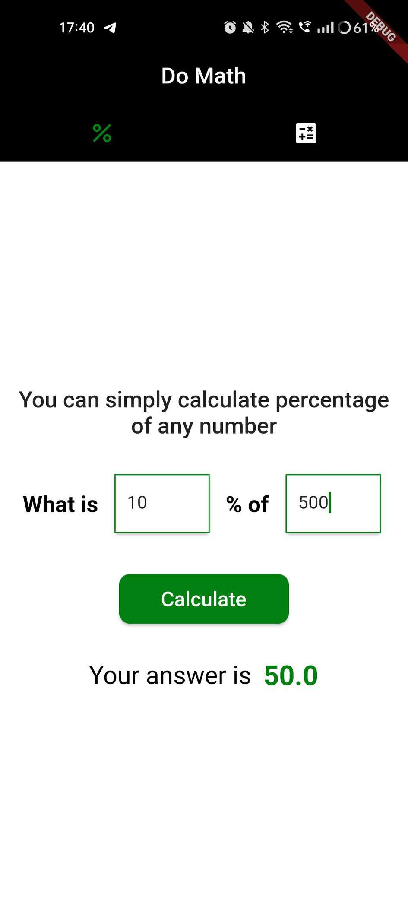
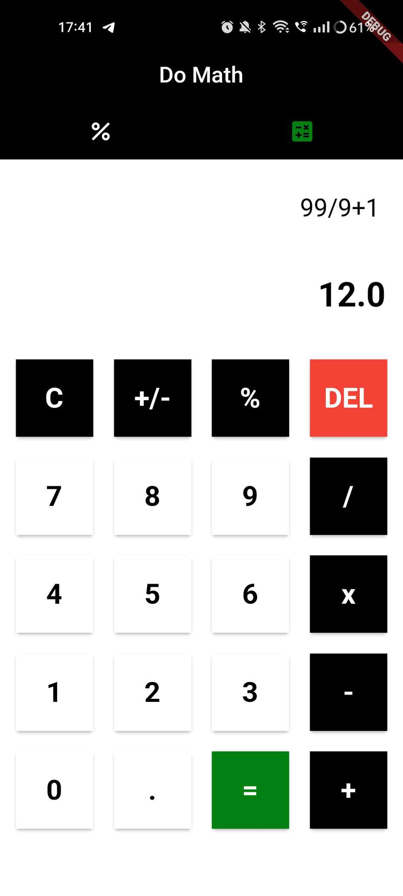

# domath

A Multi-purpose calculator 

 - You can evaluate daily mathematical expression.
 - You can evaluate percentage of any entered number.
 - One library is used named "math_expressions".

   
